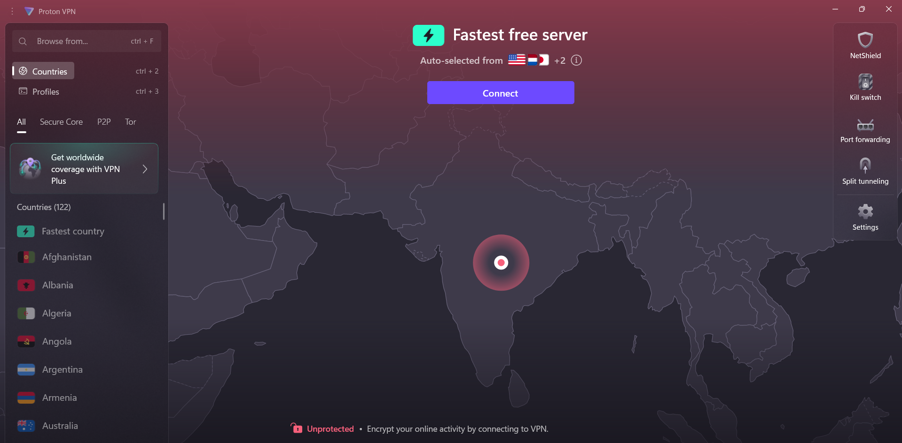
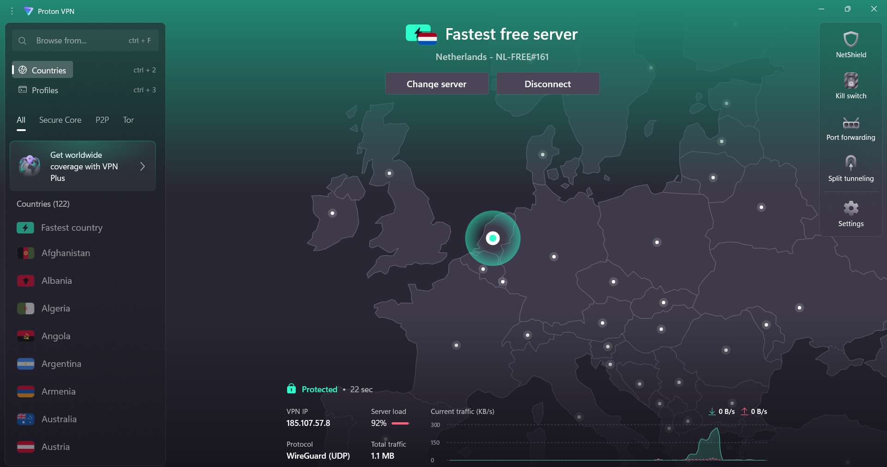
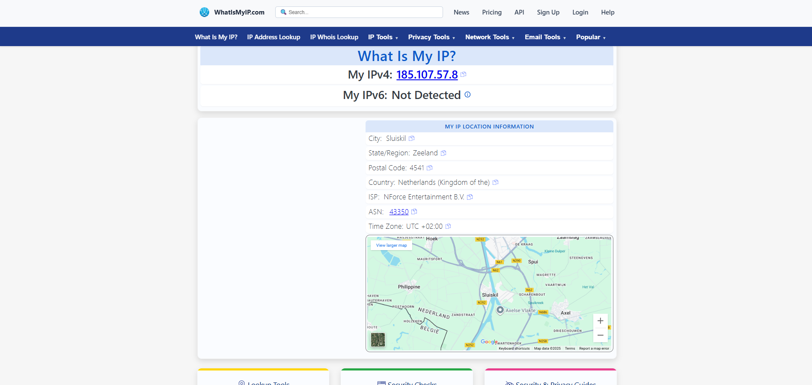

# VPN Setup & Privacy Research

## Objective
To understand, configure, and prove the effectiveness of VPNs in protecting privacy and enabling secure communication.

## VPN Used
**ProtonVPN** (Free Tier)

## Steps Performed

### 1. Download & Install
Downloaded ProtonVPN from the official website and created a free account.

### 2. Initial State (Disconnected)
Launched ProtonVPN without connecting to any server to capture the initial state.

*Figure 1: ProtonVPN application in disconnected state showing "Unprotected" status*

### 3. Server Connection
Connected to the fastest available free server (Netherlands - NL-FREE#161).

*Figure 2: ProtonVPN successfully connected to Netherlands server showing "Protected" status with connection details*

### 4. IP Address Verification
Visited whatismyipaddress.com to verify that the IP address changed and now appears as originating from the Netherlands.

*Figure 3: WhatIsMyIP.com showing the new IP address (185.107.57.8) with Netherlands location*

### 5. Testing & Observations
- Browsed various websites to confirm encrypted traffic flow
- Tested connection stability and speed
- Observed VPN protocol in use (WireGuard UDP)
- Monitored data transfer rates and server load

## Technical Details Observed

- **VPN IP Address:** 185.107.57.8
- **Protocol Used:** WireGuard (UDP)
- **Server Location:** Netherlands (Sluiskil, Zeeland)
- **Server Load:** 92% at time of connection
- **Connection Status:** Protected with 22-second connection time
- **ISP:** NForce Entertainment B.V

## VPN Features Observed

### Encryption & Security
- **Strong Encryption:** ProtonVPN uses robust protocols (WireGuard, OpenVPN) to encrypt all network traffic
- **IP Masking:** Successfully hides the user's real IP address and location
- **Traffic Protection:** All applications route through the secure VPN tunnel, not just web browsers

### Privacy Benefits
- **Location Spoofing:** Appears to be browsing from Netherlands instead of actual location
- **ISP Protection:** Internet Service Provider cannot see browsing activity
- **Public WiFi Security:** Encrypts data on potentially unsecured networks

## Benefits & Limitations of VPNs

### Benefits
- **Complete Traffic Encryption:** Protects all internet traffic from interception
- **IP Address Anonymization:** Hides real location and identity from websites
- **Bypass Geographic Restrictions:** Access region-locked content
- **Public Network Security:** Safe browsing on untrusted WiFi networks
- **ISP Privacy:** Prevents internet provider from tracking browsing habits

### Limitations
- **Reduced Speed:** Encryption overhead can slow down internet connection
- **Server Dependency:** Connection quality depends on VPN server performance
- **Not Complete Anonymity:** VPN provider can potentially log user activity
- **Service Blocking:** Some websites and services actively block VPN traffic
- **Trust Requirement:** Must trust VPN provider with internet traffic

## Key Concepts Learned

- **VPN (Virtual Private Network):** Secure tunnel between device and internet
- **Encryption:** Process of scrambling data to prevent unauthorized access
- **Tunneling Protocols:** Methods used to create secure connections (WireGuard, OpenVPN, IKEv2)
- **IP Masking:** Hiding real IP address behind VPN server's IP
- **Network Security:** Protection of data during transmission

## Conclusion

Successfully completed hands-on VPN setup and verification process. Gained practical understanding of:
- How VPNs protect privacy through encryption and IP masking
- The process of establishing secure connections
- Real-world benefits and limitations of VPN technology
- Technical aspects of VPN protocols and server connections

This exercise provided valuable experience with privacy tools and network security concepts essential for cybersecurity practice.

---

**Files in this repository:**
- `README.md` - This documentation
- `screenshots/vpn-disconnected.jpg` - VPN application in disconnected state
- `screenshots/vpn-connected.jpg` - VPN successfully connected with details
- `screenshots/vpn-ip-change.jpg` - IP address verification showing location change
